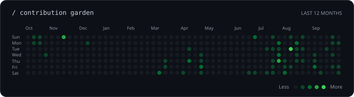

  

  

<table align="center">
  <tr>
    <td width="58%" valign="top">
      <h2>Hey, I'm Ritesh 👋</h2>
      

        I’m a developer drawn to the intersection of deep learning and software engineering. I enjoy understanding how models learn, experimenting with data, and building the systems around them — from automation and APIs to thoughtful web experiences.
      

      

        <strong>Current direction:</strong> 
        neural networks · model evaluation · systems design · open source
      

    </td>
    <td width="42%" valign="top">
      <pre>
┌─[ ritesh@github ]
├─ mode: learn + build
├─ focus: deep learning
├─ style: curious + practical
└─ status: shipping ideas
      </pre>
    </td>
  </tr>
</table>

## 🍂 A small autumn interlude

<table align="center">
  <tr>
    <td width="43%" valign="middle">
      
    </td>
    <td width="57%" valign="middle">
      <blockquote>
        
<em>Good systems, like good seasons, take time to grow.</em>

      </blockquote>
      
Taking a quiet moment between experiments, commits, and the next thing I want to understand.

    </td>
  </tr>
</table>

## Stuff I am Learning....

  My deep learning  covers neural networks, backpropagation, optimization, and model evaluation. I’m interested in the full experiment loop: preparing data, training a model, understanding its errors, and improving how well it generalizes.

  
  
  
  
  

  <code>backpropagation</code> · <code>optimization</code> · <code>regularization</code> · <code>computer vision</code> · <code>model evaluation</code>

## `/ toolkit`

  <strong>Deep learning &amp; experimentation</strong>  
  

  <strong>Web &amp; systems</strong>  
  

  <strong>Infrastructure &amp; tooling</strong>  
  

  Tools for exploring ideas, training models, and turning prototypes into useful systems.

## `/ top 4 projects`

<em>Four spaces reserved for the projects that best represent what I build.</em>

<!-- Replace each project's name, description, stack and repository URL below. -->
<table align="center">
  <tr>
    <td width="50%" valign="top">
      <h3>01 · YOUR PROJECT NAME</h3>
      
Replace this text with a short description of your first project.

      
<code>YOUR STACK</code>

      
<strong>Repository:</strong> <code>PASTE_REPO_URL_1</code>

    </td>
    <td width="50%" valign="top">
      <h3>02 · YOUR PROJECT NAME</h3>
      
Replace this text with a short description of your second project.

      
<code>YOUR STACK</code>

      
<strong>Repository:</strong> <code>PASTE_REPO_URL_2</code>

    </td>
  </tr>
  <tr>
    <td width="50%" valign="top">
      <h3>03 · YOUR PROJECT NAME</h3>
      
Replace this text with a short description of your third project.

      
<code>YOUR STACK</code>

      
<strong>Repository:</strong> <code>PASTE_REPO_URL_3</code>

    </td>
    <td width="50%" valign="top">
      <h3>04 · YOUR PROJECT NAME</h3>
      
Replace this text with a short description of your fourth project.

      
<code>YOUR STACK</code>

      
<strong>Repository:</strong> <code>PASTE_REPO_URL_4</code>

    </td>
  </tr>
</table>

## `/ github pulse`

<table align="center">
  <tr>
    <td width="50%" valign="top">
      
    </td>
    <td width="50%" valign="top">
      
    </td>
  </tr>
</table>

  

  

## `/ say hello`

  
  
  

Discord: <code>ichigo_getsugatensho</code> · <a href="mailto:kingofpirates451@gmail.com">kingofpirates451@gmail.com</a>

  

<i>“First, solve the problem. Then, write the code.”</i>

## `/ contribution garden`

  

  Green dots, dark mode, steady progress. Refreshed every 12 hours.

